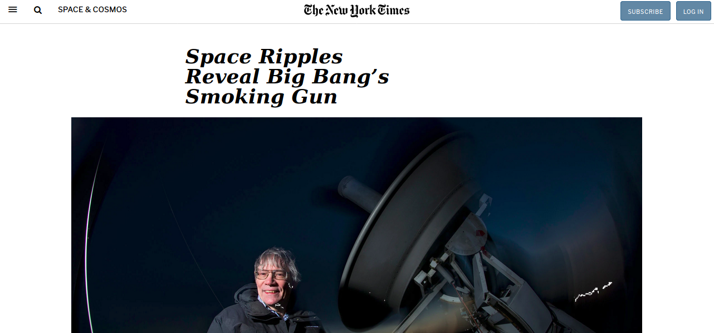

# Project: Positioning and Floating Elements

## Brief introduction

A replica website of [this](https://web.archive.org/web/20190410204320/https://www.nytimes.com/2014/03/18/science/space/detection-of-waves-in-space-buttresses-landmark-theory-of-big-bang.html?_r=0) site.

## Demo

## Live version

[Here](https://ivanderlich.github.io/newyorktimesarticle/).

## Installation

- Clone or download the repo. 
- Move the new folder and open index.html.

## Skills we have demonstrated after completing the project

- Working with elements.

- Floats.

- Positioning.

- Display.

- Box Model.

## Contributors

[Diego Arvizu](https://github.com/diegoarvz4).

[Ivan Derlich](https://github.com/IvanDerlich).

## The article today

[Here](http://www.nytimes.com/2014/03/18/science/space/detection-of-waves-in-space-buttresses-landmark-theory-of-big-bang.html?_r=0).

## Backgroud

The purpose was to learn to style with CSS floats and positioning.
